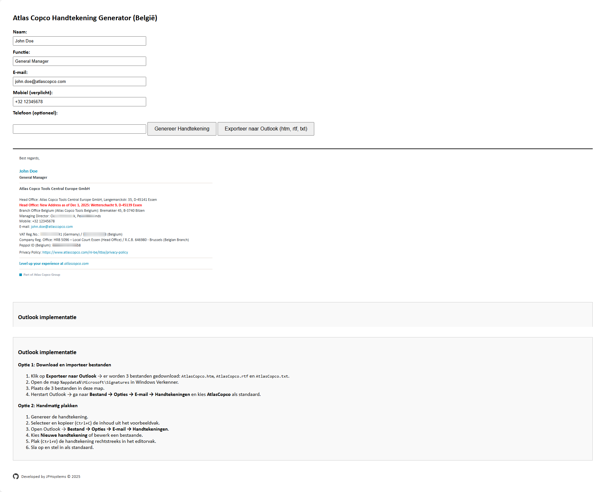

# ✨ E-mail Signature Generator

<p align="center">
  
  
</p>

---

 ## 🚀 Live Demo
Bekijk en gebruik de generator hier:  
👉 [Signature Generator](https://jphermans.github.io/acsignature/)


---

## 📌 Over dit project
Een eenvoudige tool om automatisch professionele e-mailhandtekeningen te genereren, speciaal afgestemd op gebruik in België.
Gebouwd met **HTML, CSS en JavaScript**.  

De generator:
- ✅ Maakt automatisch een **ZIP** met `.htm`, `.rtf`, `.txt` en `_files` map.  
- ✅ Naamgeving volgens Outlook-standaard: `AtlasCopco(naam@atlascopco.com).*`.  
- ✅ Zorgt dat verplichte velden (Naam, Functie, E-mail, Mobiel) ingevuld zijn.
- ✅ Controleert dat het e-mailadres eindigt op `@atlascopco.com`.
- ✅ Geeft duidelijke foutmeldingen bij ontbrekende velden.
- ✅ Houdt de knoppen consistent: **Velden leegmaken** gebruikt dezelfde secundaire stijl als de downloadknop.
- ✅ Volledig responsieve interface – inclusief uitlegkaart – voor comfortabel gebruik op mobiel, tablet en desktop.

---

## 🎨 Layout & Kleuren
De tool gebruikt een strak en clean design met herkenbare kleuren:

| Accentkleur |  | `#0092BC` |
| Donkergrijs |  | `#2F363A` |
| Lichtgrijs  |  | `#E1D6CE` |


---

## ⚙️ Installatie & Gebruik

### 1. Open de generator
Download of clone dit project en open het bestand **index.html** in je browser.

### 2. Vul je gegevens in
- Naam  
- Functie  
- E-mail (moet eindigen op `@atlascopco.com`)  
- Mobiel (verplicht)  
- Telefoon (optioneel)  

### 3. Genereer je handtekening
Klik op **Genereer Handtekening**.  
Je ziet meteen een preview.

### 4. Exporteer naar Outlook
Klik op **Exporteer naar Outlook (ZIP)** → er wordt een ZIP-bestand aangemaakt met:
- `AtlasCopco(naam@atlascopco.com).htm`  
- `AtlasCopco(naam@atlascopco.com).rtf`  
- `AtlasCopco(naam@atlascopco.com).txt`  
- `AtlasCopco(naam@atlascopco.com)_files/`  

### 5. Zet de bestanden in Outlook
- Pak het ZIP-bestand uit.  
- Open de map:  
  ```bash
  %appdata%\Microsoft\Signatures





## ⚙️ Installatie & Gebruik

### 1. Open de generator
Download of clone dit project en open het bestand **index.html** in je browser.

### 2. Vul je gegevens in
- Naam  
- Functie  
- E-mail (moet eindigen op `@atlascopco.com`)  
- Mobiel (verplicht)  
- Telefoon (optioneel)  

### 3. Genereer je handtekening
Klik op **Genereer Handtekening**.  
Je ziet meteen een preview.

### 4. Exporteer naar Outlook
Klik op **Exporteer naar Outlook** → er worden 3 bestanden aangemaakt:
- `AtlasCopco.htm`  
- `AtlasCopco.rtf`  
- `AtlasCopco.txt`  

### 5. Zet de bestanden in Outlook
- Open de map:  
  ```bash
  %appdata%\Microsoft\Signatures

 

